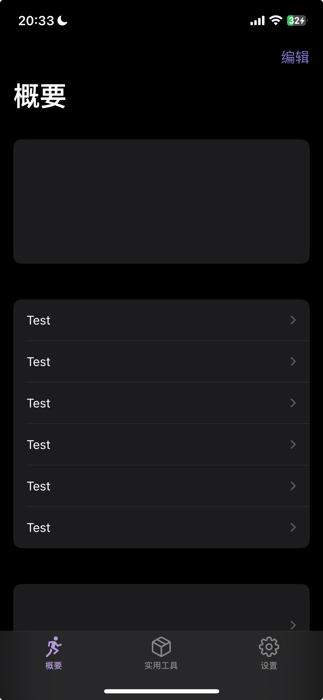

# 文件说明&具体任务

[TOC]

> 主要了解“概要”tab栏下的各个子模块。

## 概要（文件夹`Overview`目录）

1. `RootTable.swift` 是APP的主界面对应的视图控制器（也是概要Tab的根视图控制器），作用：

* 控制section1、2和3的UI、显示文字和跳转界面
* 显示section1的具体数据分析结果

2. `overviewItem.plist` 存储需要显示&本地化（翻译）的文本。

---

概要下的各个分区列表项（按钮）对应的代码在文件夹`Overview`目录下。`Overview`目录下的三个子目录：

* `sec1`对应section1。如果授权失败，这个section会用来提示用户无法访问；否则，这个section初步确定功能：**最近一次运动的分析概况**。并且点击section1跳转到更加具体的界面。
* `sec2`对应section2。包含的列表项目：
  * **历史数据查询、可视化**
  * **运动数据分析**
  * 
* `sec3`对应section3。包含的列表项目：
  * 制定计划功能，与push notification组合

### sec1

### sec2

#### 历史数据查询与可视化

#### 数据分析的具体任务🌟🌟

> 目前，虽然有少数软件可以提供跑步训练计划，或针对跑步者具体情况简单设计运动方案，但仍无法根据跑步运动数据的统计结果，或前后数据的对比结果来智能化地进行分析。
>
> 运动数据分析比较具有挑战性，可能需要大家一起加把油。

1. **评估运动表现**

> 本APP已经实现基于距离和时间评估运动表现（运动强度），评估方法为简单加权。此分析过于简单，需要优化。

* 选取评估运动表现的指标（比如速度、心率、距离、VO2Max），具体的可以看看相关论文。
  * 比如 https://www.nature.com/articles/s41467-020-18737-6
  * 这篇论文选取了两个指数来描述跑步者的表现，分别是（1）耐力（耐力指数）和（2）要求MAP输出的速度（有氧功率指数）
* 建立模型，构建评估运动表现的方法。

2. **优化已有的聚类分析**

3. **建立线性回归模型**

## 其他（先不用理会）

* 设置tab栏在`Settings`文件夹下
* 实用工具tab栏在`Toolbox`文件夹下
* 
